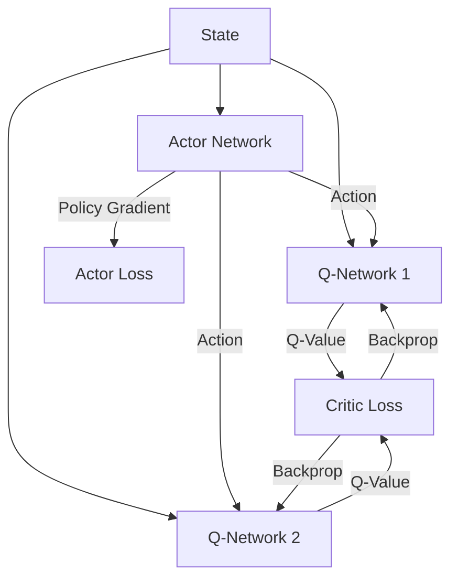
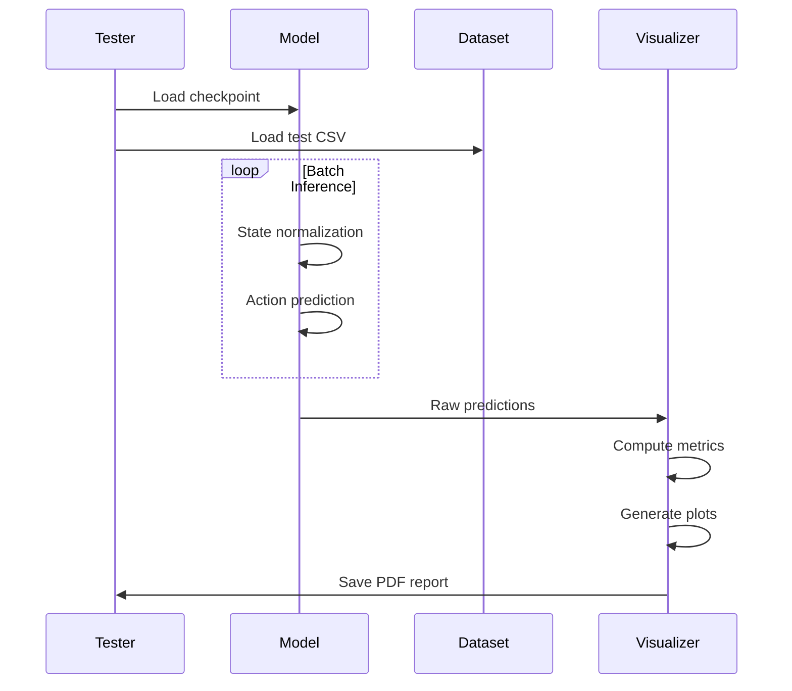

# SAC-CQL Diabetes Management Technical Documentation

## 1. Core Architecture

### Neural Network Structure (SACCQL_training.py)
```python
class SACAgent(nn.Module):
    def __init__(self, state_dim=8, action_dim=1):
        # Actor Network
        self.actor = nn.Sequential(
            nn.Linear(state_dim, 256),
            nn.LayerNorm(256),
            nn.Mish(),
            nn.Linear(256, 128),
            nn.LayerNorm(128),
            nn.Mish(),
            nn.Linear(128, action_dim)
        
        # Twin Q-networks
        self.q1 = self._create_q_network(state_dim, action_dim)
        self.q2 = self._create_q_network(state_dim, action_dim)
```

**Algorithm Flow:**
1. **Input Processing** (8D state vector):
   - Current glucose + derivatives
   - Heart rate + derivatives
   - Insulin-on-board (IOB)
   - Hour of day (circadian encoding)

2. **Actor Network**:
   - 3 fully-connected layers with Mish activation
   - Layer normalization for stable gradients
   - Final tanh activation constrains actions to [-1,1]

3. **Critic Networks**:
   - Twin Q-networks prevent overestimation
   - Each has 3 linear layers with LeakyReLU
   - Input: state + action concatenated
   - Output: Q-value estimate

4. **CQL Regularization**:
   - Added to critic loss: E[log∑exp(Q(s,a)) - Q(s,π(s))]
   - Prevents Q-value overestimation on OOD actions

## 2. Training Process

### Key Components:
```python
def train_sac(...):
    # Core training loop components
    target_q = rewards + 0.99 * (1 - dones) * q_next
    critic_loss = F.mse_loss(current_q1, target_q) + F.mse_loss(current_q2, target_q)
    
    actor_loss = -(torch.min(q1_pred, q2_pred)).mean() 
    alpha_loss = -(log_alpha * (target_entropy + entropy)).mean()
```

**Training Steps:**
1. **Experience Sampling**:
   - 512-batch from replay buffer
   - States normalized per dimension

2. **Critic Update**:
   - Compute target Q-values with 0.99 discount
   - Add CQL regularization loss:
     ```math
     L_{CQL} = α * (log∑exp(Q(s,a)) - Q(s,π(s)))
     ```
   - Gradient clipping at 1.0

3. **Actor Update**:
   - Maximize expected Q-value + entropy
   - L2 regularization (λ=0.001) prevents overfitting

4. **Entropy Adaptation**:
   - Automatic α adjustment maintains:
     ```math
     H(π) ≥ -dim(A) (e.g., 1.0)
     ```

5. **Target Updates**:
   - Polyak averaging (τ=0.01):
     ```math
     θ_{target} = τθ + (1-τ)θ_{target}
     ```

## 3. Evaluation Metrics & Graphs

### Action Comparison Plot
**Structure:**
```python
plt.scatter(actions_true, actions_pred, alpha=0.3)
plt.plot([-1, 1], [-1, 1], 'r--')  # Perfect prediction line
```
**Interpretation:**
- X-axis: Clinician actions
- Y-axis: Model predictions
- **Ideal**: Points along red diagonal
- **Underdosing**: Cluster above diagonal
- **Overdosing**: Cluster below diagonal
- **Clinical Significance**: Vertical spread indicates meal response errors

### Glucose Distribution
**Clinical Zones:**
```python
ax.axvspan(70, 180, alpha=0.2, color='green')  # Target range
ax.axvspan(54, 70, color='orange')  # Hypo警戒
ax.axvspan(180, 250, color='orange')  # Hyper警戒
```
**Key Metrics:**
- **Time-in-Range (TIR)**: % in green zone
- **CV**: <36% = stable control
- **Left Skew**: Hypoglycemia risk
- **Right Skew**: Post-meal spikes

### State-Action Heatmaps
**Critical Relationships:**
1. **Glucose vs Action**:
   - Expected: Negative correlation
   - Danger: Positive slope (aggravates highs/lows)

2. **IOB vs Action**:
   - Expected: Negative correlation
   - Shows insulin stacking avoidance

3. **Circadian Patterns**:
   - Basal: Higher nighttime values
   - Bolus: Meal-time peaks

### Error Analysis Plot
**Components:**
```python
action_errors = actions_pred - actions_true
plt.scatter(glucose, action_errors)
```
**Pattern Detection:**
- **Hyperglycemia Errors** (glucose >180):
  - Positive errors: Under-bolusing
  - Negative errors: Over-correction
  
- **Hypoglycemia Errors** (glucose <70):
  - Any errors critical - safety risk

## 4. Neural Network Dynamics

### Actor-Critic Interaction


### CQL Loss Mechanism
**Mathematical Formulation:**
```math
L_{total} = α_E \underbrace{\mathbb{E}_{s∼D}[\log∑_a \exp(Q(s,a)) - Q(s,π(s))]}_{CQL Regularization} + \underbrace{\mathbb{E}_{s,a∼D}[(Q(s,a) - y(r,s'))^2]}_{TD Error}
```
Where:
- α_E: CQL weighting factor (default 1.0)
- y(r,s') = r + γ(1-d)min(Q_target(s',π(s')))

## 5. Clinical Validation

### Safety Metrics Table
| Metric | Target | Danger Threshold | Interpretation |
|--------|--------|-------------------|-----------------|
| TIR (%) | >70 | <50 | Primary efficacy measure |
| Hypo Events | <4 | >10 | Safety critical |
| CV (%) | <36 | >40 | Glycemic variability |
| GMI (%) | <7 | >8 | Long-term control |

### Action Safety Constraints
```python
# In environment implementation:
def _safe_action(self, action):
    action[0] = np.clip(action[0], 0, 5)  # Basal: 0-5 U/hr
    action[1] = np.clip(action[1], 0, 10)  # Bolus: 0-10 U
    return action
```
These constraints prevent clinically dangerous insulin dosing.

## 6. Visualization Pipeline

### Training Monitoring
```python
# Logging in train_sac()
writer.writerow([
    epoch, 
    critic_loss, 
    actor_loss, 
    alpha_loss,
    q1_value,
    q2_value,
    action_mean,
    action_std,
    entropy,
    grad_norm
])
```
**Key Trends:**
1. **Critic Loss**: Should stabilize <1.0
2. **Q-Values**: Should converge to [-5, 0]
3. **Action STD**: Ideal 0.2-0.6 (exploration vs exploitation)

### Evaluation Workflow


This documentation should be used alongside the code comments for full implementation details. The graphs provide both technical performance metrics and clinical safety indicators - practitioners should prioritize clinical metrics when making deployment decisions.
